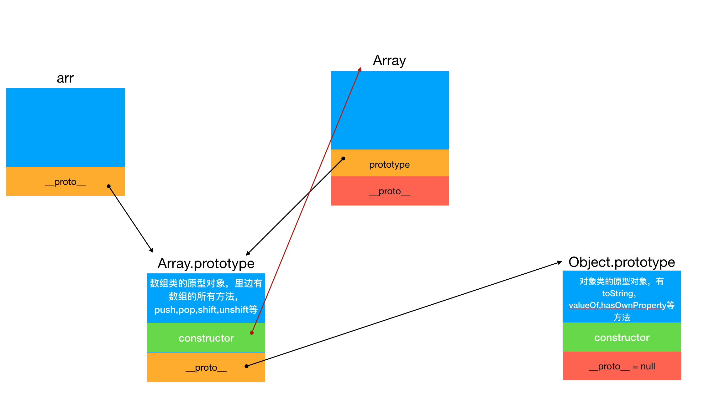
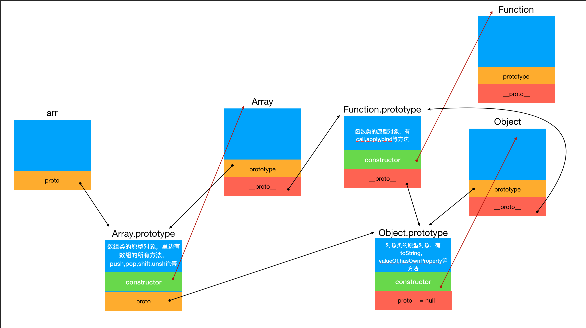

# JavaScript 中的原型链机制

众所周知 JavaScript 中的继承是基于原型链的委托机制来实现的，现在我们通过从头开始绘制原型链的示意图来真正理解原型链的继承是如何实现的

## JavaScript 中的原型链规律

1. 对象类型有一个属性 `__proto__` ，指向他的所属类的原型对象
2. 函数类型有一个属性 `prototype` ，指向它自身的原型对象
3. 原型对象中有一个属性 `constructor` ，指向它所属的构造函数

接下来我们通过例子画图来解释这三句话

## 例子 1

我们通过`Array`构造函数来绘制一下`arr`的原型链

```js
const arr = new Array();
```

按照原型链规律我们可以得到

```javascript
// arr 是一个数组，数组就是对象的一种类型，因此它的__proto__就指向所属类，也就是Array类的原型对象
arr.__proto__ = Array.prototype;

// Array的原型对象上有constructor指向它原本的构造函数
Array.prototype.constructor = Array;

// Array()既是函数也是对象类型，所以Array上还有一个属性__proto__，指向它所属类的原型，也就是Function类的原型
Array.__proro__ = Function.prototype;

// Array.prototype是一个对象，所以它的__proto__指向Object.prototype
Array.prototype.__proto__ = Object.prototype;
```

根据以上分析，当前我们得到的原型链图如下


接着我们继续分析

```js
// 同理Object.prototype和Object的关系是一样的
// 有一点不同的是Object.prototype就是原型链的最顶层了，所以
Object.prototype.__proto__ = null;

// 接着Array()是函数所以也属于Function类，因此
Array.__proto__ = Function.prototype;

// Object()同理，也是同时属于Function类
Object.__proto__ = Function.prototype;
```

于是我们基于此画出了完整的原型链继承图


