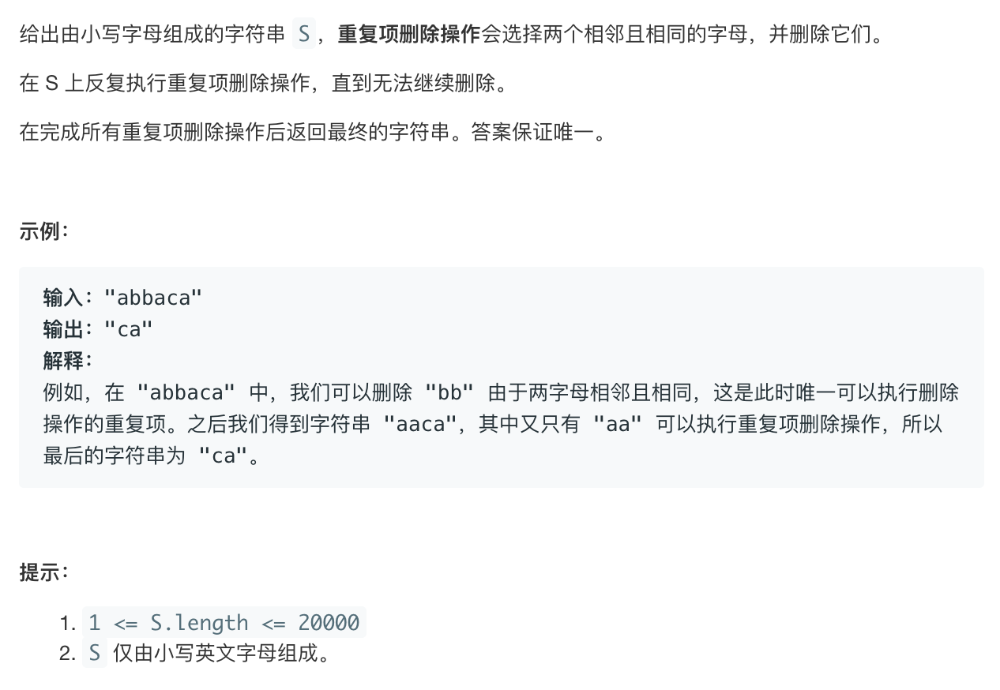

# leetcode1047:[删除字符串中的所有相邻重复项](https://leetcode-cn.com/problems/remove-all-adjacent-duplicates-in-string/)

## 题目描述



## 梳理思路

利用栈，遍历字符串，向栈内压入当前的字符

- 每次压入栈之前，要判断当前字符和栈顶的元素是否相同，相同那就弹出栈顶的元素，否则就正常压入栈中
- 最终将栈中的元素拼接成字符串返回

```javascript
const removeDuplicates = function (S) {
  const stack = [];
  for (let i = 0; i < S.length; i++) {
    if (S[i] === stack[stack.length - 1]) {
      stack.pop();
    } else {
      stack.push(S[i]);
    }
  }
  return stack.join("");
};
```

::: tip 复杂度分析

- 时间复杂度为$O(n)$，$n$为`S.length`
- 空间复杂度为$O(n)$，即栈的空间

:::
