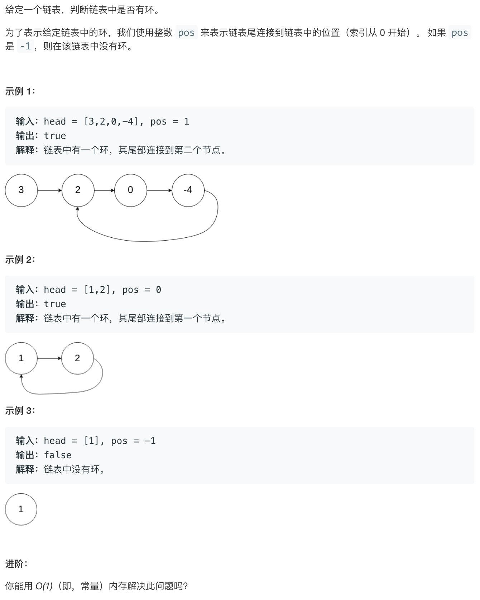

# leetcode141:[环形链表](https://leetcode-cn.com/problems/linked-list-cycle/)

## 题目描述



## 梳理思路

### 解法一：遍历打标记

1. 遍历链表中的所有节点，给每个节点打上一个标记
2. 如果这个节点曾经被访问过，就会存在这个标记
3. 所以遍历到链表中的最后一个节点后，它的 next 指向的节点存在这个标记，那么就说明存在环形链表

```javascript
var hasCycle = function (head) {
  while (head) {
    if (head.flag) return true;
    head.flag = true;
    head = head.next;
  }
  return false;
};
```

### 解法二：哈希 map

原理和遍历打标记是一样的，只不过换成了利用`Map`来存储

```javascript
var hasCycle = function (head) {
  const map = new WeakMap();
  while (head) {
    if (map.get(head)) return true;
    map.set(head, true);
    head = head.next;
  }
  return false;
};
```

### 解法三：快慢指针

::: tip 举个例子

- 可以以跑道上的两个运动员来类比，一个跑的快，另一个跑得慢，如果是一个环形结构，那么两个人最终一定会再次相遇
- 因此我们可以设定两个指针，一个慢指针，一次移动一步，一个快指针，一次移动两部，假设当快指针还差一步就追站上满指针的时候，那么下一步快指针移动两部，慢指针移动一步，两个指针正好相遇（快指针与满指针相差两两步或者三步其实都一样）

:::

1. 创建一个快指针，指向当前节点的两步之后，即`head.next.next`，一个慢指针，指向当前节点
2. 判断只要`fast`指针和`slow`指针不相等(不相遇)，那么就继续往后走，如果相遇了即指向同一个节点了，那么就是`true`
3. 如果最终`fast`走到最后一位了，或者`fast`为`null`了，则返回 false

```javascript
var hasCycle = function (head) {
  if (!head || !head.next) {
    return false;
  }
  let fast = head.next.next;
  let slow = head;
  while (fast !== slow) {
    // 因为fast在前边，如果不是环形链表，那么最终fast指针一定会最快到达链表的尾部
    if (!fast || !fast.next) return false;
    fast = fast.next.next;
    slow = slow.next;
  }
  return true;
};
```
