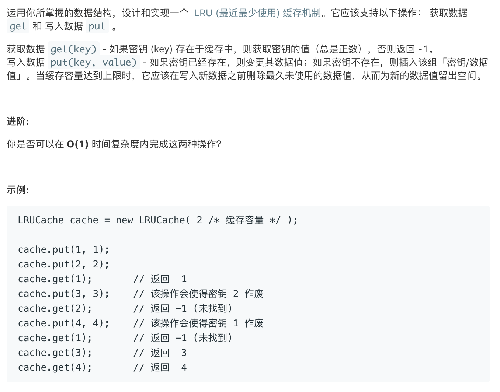

# leetcode149:[设计和实现一个 LRU(最近最少使用)缓存机制](https://leetcode-cn.com/problems/lru-cache/)

## 题目描述



## 梳理思路

### 解法一

第一种解法，利用数组来模拟优先级队列，用普通对象来做`cache`，存储`value`

- 优先级就是最近被获取的优先级设置为最高，最近添加的优先级最高，如果队列已满，则需要清除掉优先级最低的那一项
- 我们设定这个队列是在末尾的优先级最高，所以当`get`触发或者新增数据时都会把当前`key`放到队列的末尾
- 当队列已满时，我们直接把当前队列的索引为 0 的那项，删除掉，然后往队列末尾添加新项即可

```javascript
/**
 * @param {number} capacity
 */
const LRUCache = function (capacity) {
  this.keys = [];
  this.cache = Object.create(null);
  this.capacity = capacity;
};

/**
 * @param {number} key
 * @return {number}
 */
LRUCache.prototype.get = function (key) {
  if (this.cache[key]) {
    // 调整位置
    remove(this.keys, key);
    this.keys.push(key);
    return this.cache[key];
  }
  return -1;
};

/**
 * 写入数据
 * @param {number} key
 * @param {number} value
 * @return {void}
 */
LRUCache.prototype.put = function (key, value) {
  if (this.cache[key]) {
    // 如果要写入的key已经存在了，那么就更新它
    this.cache[key] = value;
    remove(this.keys, key);
    this.keys.push(key);
  } else {
    this.keys.push(key);
    this.cache[key] = value;
    if (this.keys.length > this.capacity) {
      removeCache(this.cache, this.keys, this.keys[0]);
    }
  }
};

/**
 *  移除 key
 * @param {[]} arr
 * @param {number} key
 */
const remove = (arr, key) => {
  if (arr.length) {
    const index = arr.indexOf(key);
    if (index > -1) {
      return arr.splice(index, 1);
    }
  }
};

/**
 *  移除缓存
 */
const removeCache = (cache, keys, key) => {
  cache[key] = null;
  remove(keys, key);
};

/**
 * Your LRUCache object will be instantiated and called as such:
 * var obj = new LRUCache(capacity)
 * var param_1 = obj.get(key)
 * obj.put(key,value)
 */
```

### 解法二

利用 `Map` 数据结构可以按照添加数据的顺序来存储的特性来实现，普通 `Object` 对象会自己进行排序，比如数字为 `key` 的时候会自动转为字符串并排序

```javascript
/**
 * @param {number} capacity
 */
const _LRUCache = function (capacity) {
  this.cache = new Map();
  this.capacity = capacity;
};

/**
 * @param {number} key
 * @return {number}
 */
_LRUCache.prototype.get = function (key) {
  if (this.cache.has(key)) {
    let temp = this.cache.get(key);
    this.cache.delete(key);
    this.cache.set(key, temp);
    return temp;
  }
  return -1;
};

/**
 * 写入数据
 * @param {number} key
 * @param {number} value
 * @return {void}
 */
_LRUCache.prototype.put = function (key, value) {
  if (this.cache.has(key)) {
    // 存在即更新（删除后加入）
    this.cache.delete(key);
  } else if (this.cache.size >= this.capacity) {
    // 不存在即加入
    // 缓存超过最大值，则移除最近没有使用的
    // 这里是因为keys方法返回的是个Iterator对象，所以每调用一次next方法才能获取一次值
    // 这里调用一次next方法就是获取map中的第一项
    this.cache.delete(this.cache.keys().next().value);
  }
  this.cache.set(key, value);
};
```
