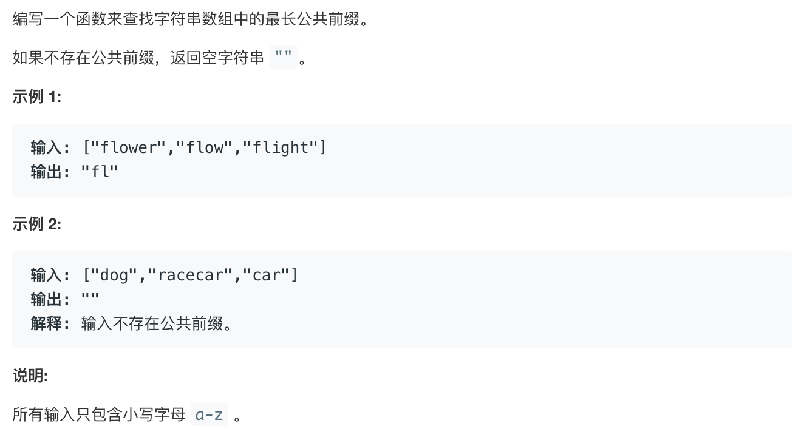

# leetcode14:[最长公共前缀](https://leetcode-cn.com/problems/two-sum/)

## 题目描述



## 梳理思路

### 解法一：逐个比较，然后截取每次比较出来的相同的字符串，作为当前选出的最长公共前缀

```javascript
const longestCommonPrefix = function (strs) {
  if (strs === null || strs.length === 0) return "";
  // 假设当前的最长公共前缀是第一项
  let prevs = strs[0];
  // 外层循环数组，遍历每个字符串
  for (let i = 0; i < strs.length; i++) {
    // 内层循环当前字符串，但是要对遍历的长度做控制，当下标已经大于了当前字符串的长度或者已经大于当前选出来的公共前缀prevs的长度时，就要停止
    let j = 0;
    // j其实就是控制字符串循环到哪一位，一旦比较不同，跳出循环，那么此时的j就是当前的最长公共前缀的最后一位
    for (; j < prevs.length && j < strs[i].length; j++) {
      if (prevs.charAt(j) !== strs[i].charAt(j)) break;
    }
    // 截取出当前选出的最长公共前缀
    prevs = prevs.substring(0, j);
    if (prevs === "") return "";
  }
  return prevs;
};
```

::: tip 复杂度

- 时间复杂度 `O(s)` -- `s`为字符串长度的总和
- 空间复杂度 `O(1)` -- `prevs`的空间

:::

### 解法二：筛选出最大和最小字符串来进行比较

- 字符串比较大小时是按照字母的 ascii 码来做比较的，因此可以根据此来选出最大和最小的字符串
- 如果最大值和最小值都有公共前缀，那么他就一定是所有字符串的公共前缀

```javascript
const longestCommonPrefix = function (strs) {
  if (strs === null || strs.length === 0) return "";
  if (strs.length === 1) return strs[0];
  let min = 0;
  let max = 0;
  for (let i = 0; i < strs.length; i++) {
    if (strs[min] > strs[i]) min = i;
    if (strs[max] < strs[i]) max = i;
  }
  for (let j = 0; j < strs[min].length; j++) {
    if (strs[min].charAt(j) !== strs[max].charAt(j)) {
      return strs[min].substring(0, j);
    }
  }
  return strs[min];
};
```

::: tip 复杂度

- 时间复杂度 `O(n+m)` -- `n` 是数组的长度，`m` 是最小值的长度
- 空间复杂度 `O(1)` -- `min` 和 `max` 的空间，是常数

:::

### 解法三：分治策略，归并思想

这里就是将原本的`strs`，拆分成两两一对，然后分别去进行比较，然后将这两两一对中选出的最长公共前缀再去进行比较，这样最终筛选出来的就是数组中字符串的最长公共前缀了

```javascript
const __longestCommonPrefix = (strs) => {
  if (strs === null || strs.length === 0) return "";
  return lCPrefixRec(strs);
};
/**
 * - 将数组从中间拆分，递归直到最终的数组长度为1，返回当前的字符串
 * - 然后拿字符串去两两比较
 * @param {string[]} arr
 */
function lCPrefixRec(arr) {
  const length = arr.length;
  if (length === 1) {
    return arr[0];
  }
  const mid = Math.floor(length / 2);
  const left = arr.slice(0, mid);
  const right = arr.slice(mid, length);
  return lCPrefixTwo(lCPrefixRec(left), lCPrefixRec(right));
}
/**
 * 比较两个字符串，选出公共前缀
 * @param {string} str1
 * @param {string} str2
 */
function lCPrefixTwo(str1, str2) {
  let j = 0;
  for (; j < str1.length && j < str2.length; j++) {
    if (str1.charAt(j) !== str2.charAt(j)) {
      break;
    }
  }
  return str1.substring(0, j);
}
```
