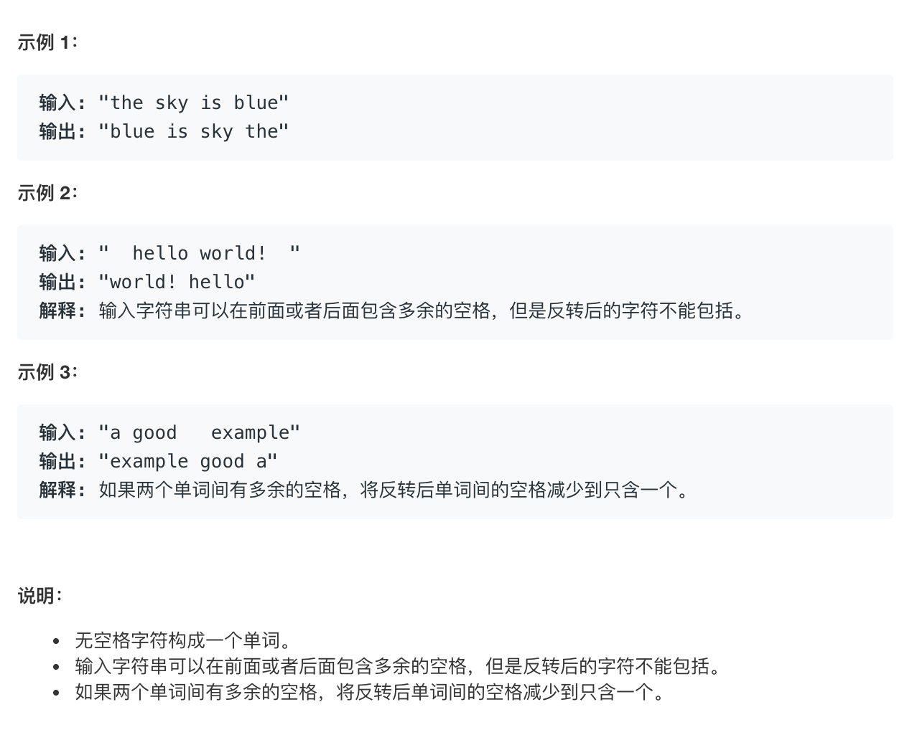

# leetcode151:[翻转字符串里的单词](https://leetcode-cn.com/problems/reverse-words-in-a-string/)

## 题目描述



## 梳理思路

### 解法一：我是一个无情的 API 机器--正则表达式匹配

除了要构建一个存储所有值的栈`items`之外，还需要构建一个辅助栈`helper`来帮助我们存储一些值。`helper`入栈的规则是，依次把最小值压入栈中，这样最终的`helper`的栈顶存储的就是最小值

```javascript
var reverseWords = function (s) {
  const reg = /\s*(\S+)\s*/g;
  const arr = [];
  s.replace(reg, (...arg) => {
    arr.push(arg[1]);
  });
  return arr.reverse().join(" ");
};
```

::: tip 复杂度分析

- 时间复杂度`O(n)` -- `n`为字符串的长度
- 空间复杂度 `O(n)` -- `arr` 空间

:::

### 解法二：利用队列(或栈也可以)，将字符串去除两端的空格后，字符串就可以以空格来分割出每个单词，然后将从左到右单词依次放入队列的头部，这样最终的队列就是倒着的，再将其转为以空格分割的字符串即可

```javascript
var _reverseWords = function (s) {
  let left = 0;
  let right = s.length - 1;
  const queue = [];
  let word = "";
  // 去除首尾空格
  while (s.charAt(left) === " ") left++;
  while (s.charAt(right) === " ") right--;
  while (left <= right) {
    const char = s.charAt(left);
    if (char === " " && word) {
      queue.unshift(word);
      word = "";
    } else if (char !== " ") {
      word += char;
    }
    left++;
  }
  // 循环到字符串的最后一位时，跳出循环，将最后一个单词放入队列的头部
  queue.unshift(word);
  return queue.join(" ");
};
```

::: tip 复杂度分析

- 时间复杂度`O(n)` -- `n`为字符串的长度
- 空间复杂度 `O(n)` -- 队列所需要的空间

:::
