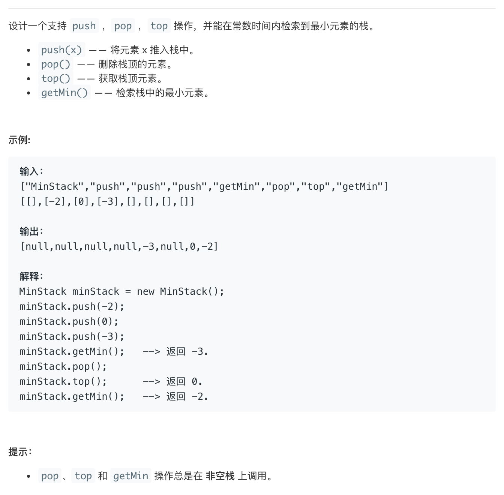

# leetcode155:[最小栈](https://leetcode-cn.com/problems/min-stack/)

## 题目描述



## 梳理思路

### 解法一：借助辅助栈

除了要构建一个存储所有值的栈`items`之外，还需要构建一个辅助栈`helper`来帮助我们存储一些值。`helper`入栈的规则是，依次把最小值压入栈中，这样最终的`helper`的栈顶存储的就是最小值

```javascript
/**
 * initialize your data structure here.
 */
const MinStack = function () {
  this.items = [];
  this.helper = [];
};
/**
 * @param {number} x
 * @return {void}
 */
MinStack.prototype.push = function (x) {
  this.items.push(x);
  // 当helper栈为空，或者当前项小于helper中的栈顶的项时，再压入helper栈中
  // 因此helper栈中的栈顶存储的值一定是当前的最小值
  if (this.helper.length === 0 || x <= this.helper[this.helper.length - 1]) {
    this.helper.push(x);
  }
};

/**
 * @return {void}
 */
MinStack.prototype.pop = function () {
  const cur = this.items.pop();
  // 因为helper栈顶的是最小值，所以每次pop的时候都要判断当前只是不是最小值，如果恰巧是最小值，那么也要顺便把helper中栈顶的最小值给他pop掉
  if (cur === this.helper[this.helper.length - 1]) {
    this.helper.pop();
  }
};

/**
 * @return {number}
 */
MinStack.prototype.top = function () {
  return this.items[this.items.length - 1];
};

/**
 * @return {number}
 */
MinStack.prototype.getMin = function () {
  return this.helper[this.helper.length - 1];
};

/**
 * Your MinStack object will be instantiated and called as such:
 * var obj = new MinStack()
 * obj.push(x)
 * obj.pop()
 * var param_3 = obj.top()
 * var param_4 = obj.getMin()
 */
```

::: tip 复杂度分析
因为`getMin`是直接获取栈顶元素的方式，所以时间复杂度为`O(1)`
但是由于借助了辅助栈，所以空间复杂度是`O(n)`
:::
