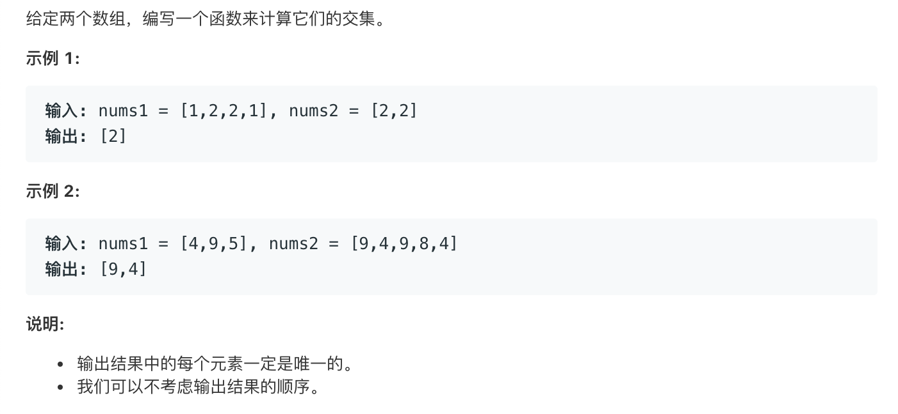

# leetcode349:[两个数组的交集](https://leetcode-cn.com/problems/intersection-of-two-arrays/)

## 题目描述



## 梳理思路

### 解法一

解法 1：利用`filter`和`includes`来选出两个数组中的相同项，然后利用`set`数据结构来进行去重

```javascript
const intersection = function (nums1, nums2) {
  return Array.from(new Set(nums1.filter((item) => nums2.includes(item))));
};
```

### 解法二

解法 2：利用双指针的方式来进行匹配

1. 把`nums1`和`nums2`进行大小排序，最小的项在数组的前面
2. 设定 `i` 和 `j` 分别为 0，`i`代表`nums1`的当前项的指针，`j`代表`nums2`的当前项的指针
3. 对数组进行循环
   - 只要`i`或者`j`有一项的大小超过了它所对应的数组的长度，就跳出循环
   - 当`nums1`的当前项小于`nums2`的当前项时，说明当前循环`nums1`的最小项小于`nums2`的最小项，所以让`nums1`对应的`i++`
   - 同理`nums1`的当前项大于`nums2`的当前项时，让`j++`
   - 当两项相等的时候添加的`set`数据结构中，完成去重
4. 最终将`set`转为数组返回

```javascript
const intersection = function (nums1, nums2) {
  nums1 = nums1.sort((a, b) => a - b);
  nums2 = nums2.sort((a, b) => a - b);
  let i = 0;
  let j = 0;
  const res = new Set();
  while (i < nums1.length && j < nums2.length) {
    if (nums1[i] < nums2[j]) {
      i++;
    } else if (nums1[i] > nums2[j]) {
      j++;
    } else {
      res.add(nums1[i]);
      i++;
      j++;
    }
  }
  return Array.from(res);
};
```

## 扩展：获取多个数组的交集

```javascript
const __intersection = (...args) => {
  if (args.length === 0) {
    return [];
  }
  if (args.length === 1) {
    return args[0];
  }
  return Array.from(
    new Set(
      args.reduce((prev, cur) => {
        return prev.filter((item) => cur.includes(item));
      }, args[0])
    )
  );
};
```
