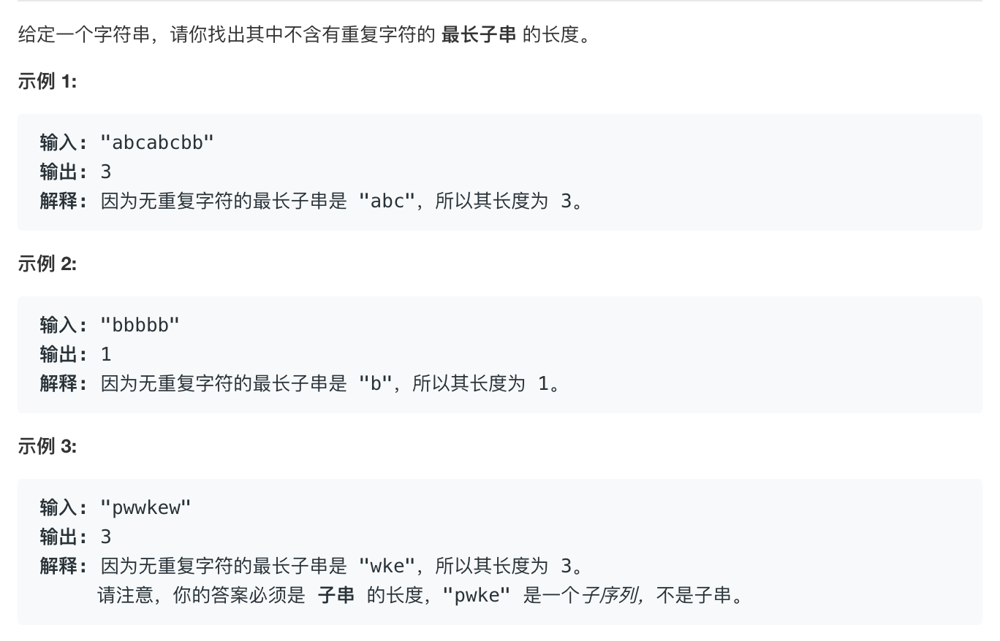

# leetcode3:[无重复字符的最长子串](https://leetcode-cn.com/problems/longest-substring-without-repeating-characters/)

## 题目描述



## 梳理思路

> 假设字符串为 `abcbc`

### 解法一：利用数组来存储当前的不重复的字符串

1. 设定一个数组来存储当前出现的不重复的子串中每项，设定变量`max`来存储出现过的子串的最大长度
2. 遍历字符串，去数组中比较，是否数组中已经存在了与当前项相同的字符串，

- 如果存在，那么就把在数组中出现的重复的项以及之前的项全部删除掉，例如数组是`['a','b','c']`，字符串为`abcac`，那么当匹配到第二个`a`的时候，就要把数组中之前出现的`a`及之前项全删掉，变成`['b','c']`，然后再把后边比配到的项添加进数组中变成['b','c','a']
- 此外每次 push 完成都要去设置 max，设置 max 的规则是去比较当前的 max 和当前数组的长度，取出最大值，因此这样取出来的就是出现的最长的字符串的长度

```javascript
const lengthOfLongestSubstring = function (s) {
  // 设定一个数组来存储当前出现的不重复的子串中每项
  const arr = [];
  let max = 0;
  for (let i = 0; i < s.length; i++) {
    const index = arr.indexOf(s[i]);
    if (index >= -1) {
      arr.splice(0, index + 1);
    }
    arr.push(s.charAt(i));
    max = Math.max(arr.length, max);
  }
  return max;
};
```

::: tip 复杂度分析

- 时间复杂度为 `O(n^2)`，因为`indexOf`本质上也是遍历，它的时间复杂度也是 `O(n)`
- 空间复杂度就是维护的数组和 `max` 变量，`max` 是常量，数组是 `O(n)`

:::

### 解法二：维护下标

遍历这个字符串，维护两个下标`i`为起始下标，`j`为截止下标，利用这两个下标来截取字符串，遍历的时候只让`j`去增长，只在碰到相同字符串的时候才去更新`i`下标，`i`下标在每次匹配到相同字符串的时候，设定`i`为当前项的后一项，即`i+index+1`，这样下次匹配的时候字符串就从当前重复项的下一项开始匹配了

```javascript
const lengthOfLongestSubstring = function (s) {
  let max = 0;
  for (let i = 0, j = 0; j < s.length; j++) {
    const index = s.substring(i, j).indexOf(s[j]);
    if (index >= 0) {
      i = i + index + 1;
    }
    max = Math.max(max, j - i + 1);
  }
  return max;
};
```

::: tip 复杂度分析

和第一种方法相同

- 时间复杂度为 `O(n^2)`，因为`indexOf`本质上也是遍历，它的时间复杂度也是 `O(n)`
- 空间复杂度都是常量`O(1)`

:::

### 解法三：利用 Map

- 这个方法其实也是利用下标的方式来做计算，`map`设置当前匹配到的字符为`key`,当前字符的在字符串中的下标为`key`
- map 结构为`{'a':0,'b':1,'c':2,'a':3,c:'4'}`
- 所以利用`i`做为起始下标的标记，`j`作为截止下标的标记
- 当`map`的`get`方法匹配到当前`map`结构中已经存在了当前值，就把`i`设置为当前值的下一项

```javascript
const lengthOfLongestSubstring = function (s) {
  const map = new Map();
  let max = 0;
  for (let i = 0, j = 0; j < s.length; j++) {
    if (map.has(s[j])) {
      // 因为map数据结构的get方法可能会获取到之前的项，所以需要去取最大值
      i = Math.max(map.get(s[j]) + 1, i);
    }
    map.set(s[j], j);
    max = Math.max(max, j - i + 1);
  }
  return max;
};
```

::: tip 复杂度分析

- 其实就是利用 `map` 的 `get` 方法是 `O(1)`的时间复杂度，
- 空间复杂度`map`存储是 `O(n)`

:::
