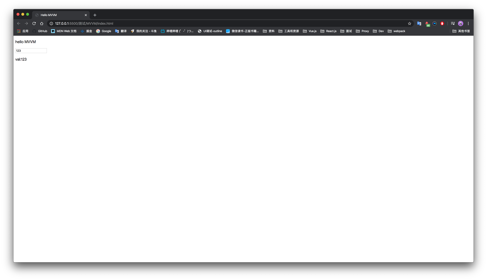

# 实现 Vue 中的 MVVM 原理(2.0 版本)

先看一下 Vue 的一个基本用法

```html
<body>
  <div id="app">
    <p>
      {{message}}
    </p>
    <input type="text" v-model="val" />
    <p>
      val:{{val}}
    </p>
  </div>

  <script src="https://cdn.jsdelivr.net/npm/vue/dist/vue.js"></script>
  <script>
    const vm = new Vue({
      el: "#app",
      data: {
        val: 123,
        message: "hello MVVM",
      },
    });
  </script>
</body>
```



可以看到 `data` 中的数据已经在 `el` 所选中的元素中渲染出来了，所以我们先来实现基本功能：

- 可以通过 `el` 选择器来选择元素
- 可以把 `data` 中的数据渲染到页面上

首先我们先来实现主要类 `Vue`，在这里我们把传进来的选项获取到，并将当前元素和当前的实例传给 `Compiler` 类，`Compiler` 类的主要功能是用来将 data 渲染到页面上

```javascript
// Vue是主要类
class Vue {
  // 参数都通过options来获取
  constructor(options) {
    // 获取元素
    this.$el = options.el;
    // 获取data
    this.$data = options.data;

    // 判断是否传了el选项，再选择是否进行后续的操作
    if (this.$el) {
      // el选择的元素和当前的vm实例传到Compiler类中
      new Compiler(this.$el, this);
    }
  }
}
```

接下来我们来实现 `Compiler` 类，这个类需要实现将选择器中的模板提取出来并替换成相应的数据，并重新渲染回页面上

```javascript
// Compiler类是用来将data渲染到页面上的类
class Compiler {
  // 接收一个el参数和vm实例
  constructor(el, vm) {
    // 这里需要做一个兼容的处理，在Vue中el选项既可以传一个选择器，也可以直接写html模板
    this.el = this.isElementNode(el) ? el : document.querySelector(el);
    this.vm = vm;

    // 取出节点放到frament中
    let fragment = this.node2Fragment(this.el);

    // 将处理完毕的frament重新渲染回页面中
    this.compile(fragment);

    // 最终将编译后的fragment重新放到el中
    this.el.appendChild(fragment);
  }

  // 该方法主要是用来判断传进来的node是否为一个DOM元素
  isElementNode(node) {
    return node.nodeType === 1;
  }

  // 该方法主要是创建一个文档碎片，将el中的模板移动到内存中，全部完成模板数据的渲染后再重新渲染回页面上
  node2Fragment(node) {
    let fragment = document.createDocumentFragment();
    let firstChild;
    // 重复的去当前的node节点中取子元素，appendChild可以实现dom的移动，由此实现了将dom节点移动到frament中
    while ((firstChild = node.firstChild)) {
      fragment.appendChild(firstChild);
    }
    return fragment;
  }

  // 主要实现将frament中的节点渲染回页面中
  compile(node) {
    let childNodes = [...node.childNodes];
    childNodes.forEach((child) => {
      // 这时要判断当前的节点时元素节点还是文本节点
      // 如果是元素节点那就还需要对该元素做递归处理，将子节点也提取出来
      // 如果是文本节点那么就直接调用文本节点的compile方法，将模板替换为数据
      if (this.isElementNode(child)) {
        // 元素节点的compile方法
        this.compileElement(child);
        // 递归子节点
        this.compile(child);
      } else {
        // 文本节点
        this.compileText(child);
      }
    });
  }

  // 该方法主要是判断改指令是否为 v- 开头的指令
  isDirective(attr) {
    return attr.startsWith("v-");
  }

  // 将渲染元素节点，主要是渲染指令如v-model
  compileElement(node) {
    let attributes = [...node.attributes];
    attributes.forEach((attr) => {
      // attr的形式 v-model 的是 {name:v-model,value:'val'}
      // v-model="val"  v-bind:click="handleClick"
      let { name, value: expr } = attr;
      // 然后判断当前的行间属性是否为 v- 开头，从而取出其中的指令
      if (this.isDirective(name)) {
        // 将指令拆分出来 [,model] v-model
        let [, directive] = name.split("-");
        // 将事件拆分出来 [bind,click] bind:click
        let [directiveName, eventName] = directive.split(":");

        // CompileUtil是一个汇合了多个编译方法的对象
        CompileUtil[directiveName](node, expr, this.vm, eventName);
      }
    });
  }

  compileText(node) {
    let content = node.textContent;
    // 判断当前文本节点是否有模板字符串，再去进行文本节点的替换
    if (/\{\{(.+?)\}\}/g.test(content)) {
      CompileUtil["text"](node, content, this.vm);
    }
  }
}
```

接下来我们来实现 `CompileUtil` 这个对象中的方法，里面包含了获取值，编译文本节点，以及模板和指令的更新方法

```javascript
const CompileUtil = {
  // 匹配文本节点中的表达值，并替换为数据
  getContentVal(vm, expr) {
    return expr.replace(/\{\{(.+?)\}\}/g, (...args) => {
      return this.getVal(vm, args[1]);
    });
  },
  // 传入vm和expr表达式，获取当前表达式的值
  getVal(vm, expr) {
    // 将表达式拆分 例如 a.b.c 拆分成 [a,b,c] 然后递归获取值
    // vm.$data.a => a.b => b.c
    return expr.split(".").reduce((data, current) => {
      return data[current];
    }, vm.$data);
  },
  text(node, expr, vm) {
    let updateFn = this.updater["textUpdater"];
    let content = this.getContentVal(vm, expr);
    updateFn && updateFn(node, content);
  },
  model(node, expr, vm) {
    let updateFn = this.updater["modelUpdater"];
    let value = this.getVal(vm, expr);
    updateFn && updateFn(node, value);
  },
  updater: {
    // v-model 更新方法
    modelUpdater(node, value) {
      node.value = value;
    },
    // 文本节点更新方法
    textUpdater(node, value) {
      node.textContent = value;
    },
  },
};
```

至此实现了将 data 编译到模板的功能

接下来是 Vue 中的重点，也就是常说的数据的响应式更新是如何实现的。
那么先把双向绑定的大概原理说明一下

- 响应式更新基于 ES5 的 Object.defineProperty 来实现，对属性进行一层拦截，设置 `setter` 和 `getter`
- 有 `Dep` 类和 `Watcher` 类
- `Dep` 主要是用来收集依赖，每一个属性都是一个 `Dep` 实例
- 每一个表达式都是一个 `Watcher`，都要收集到相对应属性的 `Dep` 实例中

`Dep` 类是订阅类，每一个属性都是一个 `Dep` 类实例，而在模板中使用的每一个表达式都是一个`Watcher`类实例，我们会在 `Observer` 观测类中执行属性的拦截，在 `get` 的时候执行依赖的收集。

首先对 Vue 类做一点修改，新增初始化时对 data 进行观测

```javascript
class Vue {
  // 参数都通过options来获取
  constructor(options) {
    // 获取元素
    this.$el = options.el;
    // 获取data
    this.$data = options.data;

    // 判断是否传了el选项，再选择是否进行后续的操作
    if (this.$el) {
      new Observer(this.$data);
      // el选择的元素和当前的vm实例传到Compiler类中
      new Compiler(this.$el, this);
    }
  }
}
```

```javascript
// 订阅类，将相对应的属性的watcher实例收集进来
// 每一个属性都是一个Dep实例
class Dep {
  // 给当前属性创建一个空队列
  constructor() {
    this.subs = [];
  }
  // 订阅方法：向队列中添加Wathcer
  addSub(watcher) {
    this.subs.push(watcher);
  }
  // 发布方法：通知当前队列中的所有watcher去执行更新
  notify() {
    this.subs.forEach((watcher) => {
      watcher.update();
    });
  }
}

// 每一个在模板中使用的表达式都是一个Watcher实例
// 比如在模板中使用了两次的val 就是两个Watcher实例
// 那么Watcher实例时在哪里初始化的呢？
// 是在页面compile的时候进行的Wathcer的初始化
class Watcher {
  constructor(vm, expr, cb) {
    this.vm = vm;
    this.expr = expr;
    this.cb = cb;

    // 先默认能获取一个旧值，当旧值和新值不相等时再去执行更新
    this.oldValue = this.get();
  }

  get() {
    // 先将当前实例获取到，并保存到Dep.target上，或者其他的全局变量都可以(window.target也可以实现)，主要是为了将当前的Watcher保存到全局，方便在getter触发的时候收集依赖
    Dep.target = this;
    // 此时会触发当前属性的getter
    const value = CompileUtil.getVal(this.vm, this.expr);
    // 完成依赖收集后可以将该变量置空
    Dep.target = null;
    return value;
  }
  update() {
    let newVal = CompileUtil.getVal(this.vm, this.expr);
    if (newVal !== this.oldValue) {
      this.cb(newVal);
    }
  }
}

// 实现对数据的观测
class Observer {
  constructor(data) {
    this.observer(data);
  }

  observer(data) {
    // 对参数进行判断，如果是对象才进行观测
    if (data && typeof data === "object") {
      for (const key in data) {
        this.defineReactive(data, key, data[key]);
      }
    }
  }

  defineReactive(obj, key, value) {
    // 递归属性
    this.observer(value);

    let dep = new Dep();
    Object.defineProperty(obj, key, {
      // 在get中收集依赖，将当前Watcher实例添加到对应的Dep订阅列表中
      get() {
        Dep.target && dep.addSub(Dep.target);
        return value;
      },

      set: (newVal) => {
        if (newVal !== value) {
          // 如果新设置的值是对象的话，也需要重新进行观测
          this.observer(newVal);
          value = newVal;
          // 当前值被更新，去派发通知告诉各个Watcher执行自己的update方法
          dep.notify();
        }
      },
    });
  }
}
```

然后我们要对 compile 中的方法做一些小改造，要在 compile 的时候对 Wathcer 进行实例的初始化

```javascript
const CompileUtil = {
  // 匹配文本节点中的表达值，并替换为数据
  getContentVal(vm, expr) {
    return expr.replace(/\{\{(.+?)\}\}/g, (...args) => {
      return this.getVal(vm, args[1]);
    });
  },
  // 传入vm和expr表达式，获取当前表达式的值
  getVal(vm, expr) {
    // 将表达式拆分 例如 a.b.c 拆分成 [a,b,c] 然后递归获取值
    // vm.$data.a => a.b => b.c
    return expr.split(".").reduce((data, current) => {
      return data[current];
    }, vm.$data);
  },
  // 新增
  // 给当前的表达式设置值，原理同获取值一样，只不过是匹配到最后一项的时候，变为设置值
  setVal(vm, expr, newVal) {
    expr = expr.split(".");
    return expr.reduce((prev, cur, currentIndex) => {
      if (currentIndex === expr.length - 1) {
        return (prev[cur] = newVal);
      }
    }, vm.$data);
  },
  text(node, expr, vm) {
    let updateFn = this.updater["textUpdater"];
    let content = this.getContentVal(vm, expr);
    // 新增
    // 给expr表达式初始化实例
    expr.replace(/\{\{(.+?)\}\}/g, (...args) => {
      new Watcher(vm, args[1], () => {
        updateFn(node, this.getContentVal(vm, expr));
      });
    });
    updateFn && updateFn(node, content);
  },
  model(node, expr, vm) {
    let updateFn = this.updater["modelUpdater"];
    let value = this.getVal(vm, expr);
    // 新增
    // 给expr表达式初始化实例
    new Watcher(vm, expr, (newValue) => {
      updateFn && updateFn(node, newValue);
    });
    node.addEventListener("input", (e) => {
      let newValue = e.target.value;
      this.setVal(vm, expr, newValue);
    });
    updateFn && updateFn(node, value);
  },
  updater: {
    // v-model 更新方法
    modelUpdater(node, value) {
      node.value = value;
    },
    // 文本节点更新方法
    textUpdater(node, value) {
      node.textContent = value;
    },
  },
};
```

下面是完成版本

<iframe
     src="https://codesandbox.io/embed/cool-mccarthy-381k9?fontsize=14&hidenavigation=1&theme=dark&view=preview"
     style="width:100%; height:500px; border:0; border-radius: 4px; overflow:hidden;"
     title="cool-mccarthy-381k9"
     allow="geolocation; microphone; camera; midi; vr; accelerometer; gyroscope; payment; ambient-light-sensor; encrypted-media; usb"
     sandbox="allow-modals allow-forms allow-popups allow-scripts allow-same-origin"
   ></iframe>
